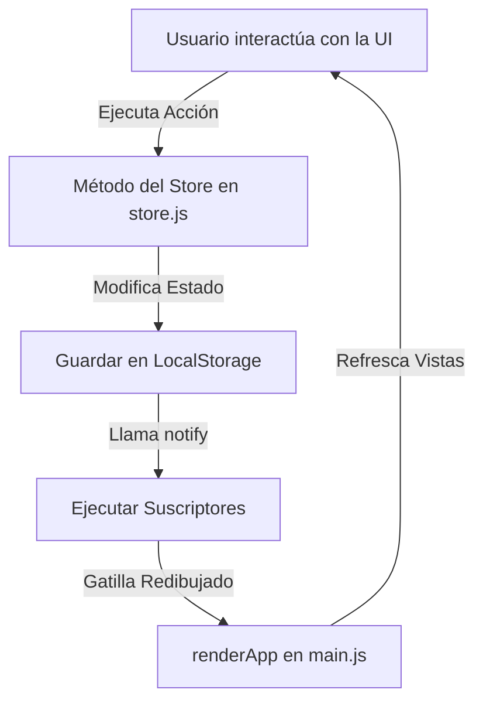

# Cadence ⚡ (TempoAgile)
> **Quality Intelligence for Agile Teams** — Una plataforma SPA reactiva y ultra-premium diseñada para medir, diagnosticar y mejorar la calidad de entrega en equipos ágiles.

[](https://developer.mozilla.org/es/docs/Web/JavaScript)
[](https://vitejs.dev/)
[](https://developer.mozilla.org/es/docs/Web/CSS)
[](https://en.wikipedia.org/wiki/Single-page_application)

---

## 🌟 ¿Qué es Cadence?

La mayoría de los dashboards ágiles tradicionales miden únicamente **velocidad** (puntos por sprint, gráficos de burn-down, etc.), pero ignoran por completo la **calidad del proceso**. Esto genera deuda técnica, releases inestables y clientes insatisfechos. 

**Cadence** (bajo la estructura de espacio de trabajo **TempoAgile**) resuelve esto introduciendo un **Motor de Inteligencia de Calidad** (Quality Calculus Engine). Analiza en tiempo real múltiples variables del backlog, el comportamiento del equipo y la validación del cliente para calcular un **Quality Score** unificado. Además, ofrece un sistema interactivo de **insights accionables** que te permiten corregir desvíos en un solo clic.

---

## 🚀 Características Clave

### 📊 1. Motor de Cálculo de Calidad (Quality Calculus Engine)
Calcula una puntuación de calidad (en una escala de `0` a `16`) para cada proyecto basándose en 4 métricas clave:
*   **`M1` · Entregables (Backlog Estimado vs. Realizado):** Mide la relación de puntos completados frente a los estimados, aplicando una penalización dinámica de `-1.2` puntos por cada historia sin estimar.
*   **`M2` · Equipo (Estabilidad del Sprint):** Evalúa la regularidad y distribución de tareas del backlog en el sprint activo.
*   **`M3` · Cliente (Feedback de Releases):** Computa la validación del cliente sobre el último release (`14.8` si está validado, `6.0` si está en riesgo).
*   **`M4` · Requerimientos (Criterios de Aceptación):** Calcula la proporción de historias de usuario que cuentan con Criterios de Aceptación (AC) bien definidos.

> ⚙️ **Pesos Personalizables:** Desde la vista de Ajustes, puedes modificar la ponderación de cada una de estas métricas (`M1`–`M4`) para adaptar la puntuación a la filosofía de tu organización.

### 💡 2. Panel de Insights Accionables Contextuales
En lugar de mostrar gráficos estáticos, la aplicación detecta problemas de manera proactiva y te permite resolverlos en el acto:
*   **Historias sin estimar:** Te advierte cuántas hay y te permite estimarlas con un control deslizante interactivo.
*   **Caídas en el score de requerimientos:** Identifica qué historias carecen de criterios de aceptación y te abre un editor directo para agregarlos.
*   **Validaciones pendientes:** Permite generar y "enviar" un *magic-link* de aprobación para el cliente con un solo clic.

### ⌨️ 3. Command Palette (Spotlight `⌘K` / `Ctrl+K`)
Un centro de comandos integrado y fluido. Al presionar el atajo de teclado, puedes:
*   Navegar instantáneamente entre vistas (`Dashboard`, `Inbox`, `Equipo`, `Ajustes`).
*   Buscar y saltar directamente al detalle de cualquier proyecto activo.
*   Crear nuevas historias de usuario sobre la marcha.
*   Activar/Desactivar el Modo Oscuro y Claro.
*   Buscar miembros del equipo.

### 🗂️ 4. Sistema Multi-Workspace
Soporte completo para trabajar con múltiples espacios de trabajo (ej. *Nikolas Studio*, *Acme Software*, *Proyectos Personales*) con aislamiento total de miembros, métricas y proyectos.

### 📋 5. Tablero Kanban/Scrum Interactivo
Cada proyecto cuenta con un tablero dinámico dividido en columnas (`Pendiente`, `En Proceso`, `Completada`). Puedes gestionar el ciclo de vida de las historias, ver sus puntos y editar sus especificaciones técnicas de forma visual.

### 🌓 6. Diseño Premium con Modo Oscuro/Claro Activo
Diseñado con una estética vanguardista que utiliza variables CSS, efectos de *glassmorphism*, gradientes armónicos HSL, tipografía moderna (*Inter* y *JetBrains Mono*) y micro-animaciones en botones y tarjetas. Cuenta con soporte responsive completo y barra de navegación móvil optimizada.

---

## 🛠️ Arquitectura Técnica y Reactividad

La aplicación está construida de forma ultra-eficiente **sin frameworks pesados** (como React o Vue), utilizando únicamente JavaScript Vanilla y ES Modules sobre Vite para una velocidad de carga instantánea.

### 🔄 El Ciclo de Reactividad (Pub-Sub Pattern)
Cadence utiliza un sistema de arquitectura reactiva propia basada en un **Store Centralizador** (`src/store.js`):
1.  **Estado Unificado:** Todo el estado de la aplicación (proyectos, historias, insights, configuración de usuario y workspaces) se almacena en una única fuente de verdad.
2.  **Persistencia:** Cada mutación se guarda automáticamente en `localStorage` de forma transparente.
3.  **Patrón Publicador-Suscriptor:** Las vistas se suscriben a los cambios del store. Cada vez que realizas una estimación, creas una historia o completas un insight, el store notifica a la aplicación y esta **redibuja reactivamente la UI** mediante el enrutador (`src/main.js`).



---

## 📂 Estructura del Proyecto

A continuación, se detalla la distribución de archivos clave del codebase:

```text
TempoAgile/
├── index.html                # Entrada principal HTML (Carga fuentes y estilos)
├── package.json              # Configuración de scripts y dependencias (Vite)
├── vite.config.js            # Configuración básica del compilador Vite
├── src/
│   ├── main.js               # Enrutador de SPA, inicializador y manejador de tema
│   ├── store.js              # Engine central: Base de datos semilla, cálculos y mutadores
│   ├── components/           # Componentes modulares y controladores de vista
│   │   ├── CommandPalette.js # Spotlight interactivo (⌘K)
│   │   ├── DashboardView.js  # Vista principal: Gráficos de calidad e Insights
│   │   ├── ProjectDetailView.js # Tablero Kanban y métricas específicas del proyecto
│   │   ├── InboxView.js      # Bandeja de entrada del sistema y logs
│   │   ├── TeamView.js       # Directorio de colaboradores por workspace
│   │   ├── SettingsView.js   # Panel de configuración de pesos e integraciones
│   │   ├── Sidebar.js        # Menú lateral dinámico y selector de workspace
│   │   ├── Topbar.js         # Encabezado superior con perfil y switch de tema
│   │   ├── NewStoryModal.js  # Popup para creación rápida de backlog
│   │   ├── PlayableActionModal.js # Ventanas emergentes interactivas para insights
│   │   ├── Toast.js          # Mensajes informativos y de éxito animados
│   └── styles/
│       ├── index.css         # Reset global, paleta de colores CSS, variables y layout
│       └── components.css    # Estilado detallado para cada componente del sistema
```

---

## 📐 El Motor de Cálculo de Calidad (Matemática de Calidad)

El Quality Score se calcula de la siguiente manera:

$$\text{Quality Score} = \frac{M_1 \cdot W_{m1} + M_2 \cdot W_{m2} + M_3 \cdot W_{m3} + M_4 \cdot W_{m4}}{100}$$

Donde:
*   $M_x$ es el valor obtenido de cada una de las 4 métricas (rango $0$ a $16$).
*   $W_{mx}$ son los pesos asignados en la vista de Ajustes (por defecto $25\%$ cada uno, sumando $100\%$).

### Clasificación del Score obtenido:
*   🔴 **`0.0 - 5.9` (Riesgo):** El proyecto presenta múltiples desestimaciones, falta de validación del cliente o requerimientos ambiguos.
*   🟡 **`6.0 - 11.9` (Aceptable):** Nivel de entrega estable pero con margen de optimización en procesos.
*   🟢 **`12.0 - 16.0` (Excelente):** Sprint altamente optimizado, backlog sano, estimado y validado con criterios rigurosos.

---

## 💻 Instalación y Uso Local

Para correr este proyecto en tu entorno local, asegúrate de tener instalado [Node.js](https://nodejs.org/).

1.  **Clonar el repositorio o ingresar a la carpeta:**
    ```bash
    cd TempoAgile
    ```

2.  **Instalar dependencias:**
    ```bash
    npm install
    ```

3.  **Iniciar el servidor de desarrollo (Vite):**
    ```bash
    npm run dev
    ```
    *Abre en tu navegador la URL local indicada (ej. `http://localhost:5173`).*

4.  **Generar el bundle de producción:**
    ```bash
    npm run build
    ```

5.  **Previsualizar el build de producción localmente:**
    ```bash
    npm run preview
    ```

---

## 🎨 Paleta de Colores y Tokens de Diseño

La interfaz se basa en una cuidada estética moderna con soporte nativo de variables CSS que cambian según el tema activo (`light` / `dark`):

*   **Background principal:** `#09090b` (oscuro) / `#f8fafc` (claro).
*   **Tarjetas & Contenedores:** `#18181b` con bordes sutiles semi-transparentes y desenfoques (*glassmorphism*).
*   **Acentos de Marca:** Gradientes dinámicos HSL que fluyen de cianes brillantes a violetas profundos.
*   **Tipografía de lectura limpia:** `Inter` para toda la UI y `JetBrains Mono` para códigos de historias de usuario y visualización de datos numéricos.

---

## 🤝 Contribuir

¡Las contribuciones son súper bienvenidas! Si encontrás un bug o tenés ideas para nuevas métricas o vistas:
1. Hacé un **Fork** del proyecto.
2. Creá una rama para tu feature (`git checkout -b feature/nueva-metric-piola`).
3. Subí tus cambios (`git commit -m 'Agrega métrica revolucionaria M5'`).
4. Hacé push de la rama (`git push origin feature/nueva-metric-piola`).
5. Abrí un **Pull Request**.

---

Desarrollado con ❤️ para equipos que no solo quieren entregar rápido, sino entregar **con calidad**. ¡Que tus sprints siempre terminen en verde! 🚀
